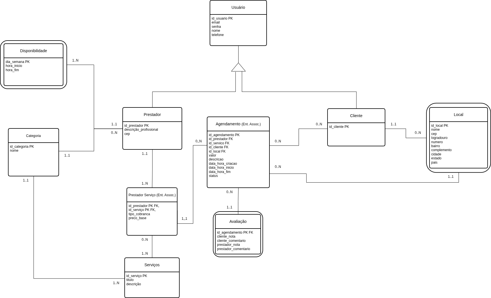

# Servixus

Trabalho da Matéria de Desenvolvimento Web do período 2026.1

## Tecnologias obrigatórias

HTML, CSS, Bootstrap, MySQL, PHP e JavaScript.

## Todo

- [x] Definir escopo ([Requisitos Funcionais](docs/RF.md), [Requisitos Não-Funcionais](docs/RNF.md) e [Regras de Negócio](docs/RN.md))
- [x] Escolher nome
- [x] Modelagem inicial do banco

- [x] Implementar modelo físico MySQL
- [ ] Definição das rotas de API

## Apresentação

- A proposta do sistema
- As tecnologias utilizadas
- As funcionalidades implementadas
- O funcionamento do código